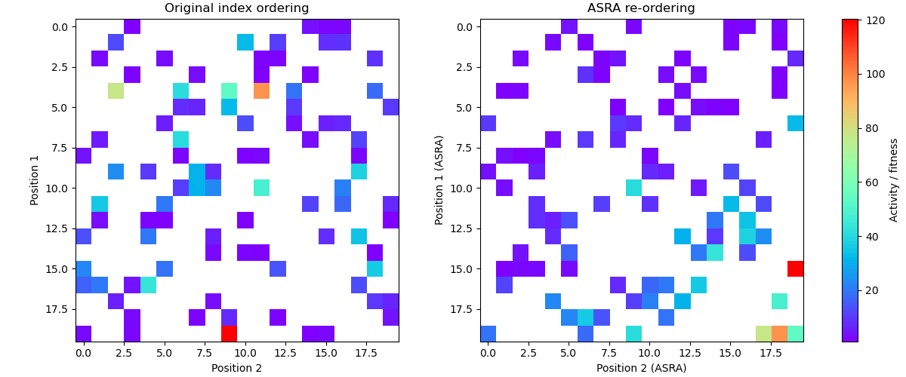

# ASRA — Adaptive Substituent Reordering Algorithm

ASRA is a method for ordering amino-acid (or block) substitutions by their effect on fitness, even when experimental sampling is sparse. It was originally introduced in:

> **Feng et al. (2012)**
> *Enhancing the Efficiency of Directed Evolution in Focused Enzyme Libraries by the Adaptive Substituent Reordering Algorithm (ASRA)*
> **Chemistry – A European Journal**, 18(8), 2106–2117.
> DOI: [https://doi.org/10.1002/chem.201103811](https://doi.org/10.1002/chem.201103811)

ASRA computes, for each position, a **relative ranking of substituent choices** such that:

* the **best** state is placed in the “top-left” corner of the conceptual grid,
* **fitness decreases** as you move away from that corner,
* the ordering is determined by **pairwise comparisons** of variants that are identical at all other positions (“matched backgrounds”).

This ranking is extremely useful for:

* visualizing combinatorial libraries,
* guiding ML-assisted exploration of sequence space,
* building interpretable 2D “corner maps” even in high-dimensional SCHEMA libraries,
* prioritizing combinations of beneficial substitutions.

Below is an example reproducing the qualitative behavior shown in Feng et al. (2012): on the left, the experimental data plotted using the original amino-acid index order; on the right, the ASRA-sorted version. The ASRA ordering systematically brings the high-fitness region into a single corner.

<p align="center">
  
</p>

Since the original code from the paper is not available, this repository provides a clean, well-tested, and extensible Python implementation of ASRA.

---

# 🔧 Installation

Download and install Mamba from [https://mamba.readthedocs.io/en/latest/installation/mamba-installation.html](https://mamba.readthedocs.io/en/latest/installation/mamba-installation.html).

Then:

```
mamba env create -f environment.yml
```

---

# 🧠 Core Concept

Given experimental data consisting of variants differing at one or more positions, ASRA computes a score

$$
Q_m \;=\; \sum_{m' \ne m} \; \sum_{n \in \mathcal{B}_{m,m'}} \Bigl( y_{m,n} - y_{m',n} \Bigr)\; w_{m,n}\; w_{m',n},
$$

where:

* $y_{m,n}$ is the measured property (e.g., fitness) of a variant with state $m$ at the focal position and background $n$,
* comparisons are only made for matched backgrounds: $\mathcal{B}_{m,m'}$ is the set of backgrounds $n$ where *both* $(m,n)$ and $(m',n)$ are observed,
* $w_{m,n}$ are optional weights reflecting measurement uncertainty.

Sorting the $Q_m$ values produces a **ranked list of states** for each position.


---

# 🚦 Two Implementations: `"paper"` and `"robust"`

This package provides two variants of the ASRA algorithm.

---

## 1. `"paper"` mode

This implementation follows the method as described in the original paper as closely as possible.

**Characteristics:**

Weighting uses

$$
w_i \;=\; \frac{1}{1 + w \left(\frac{\sigma_i}{|y_i|}\right)},
$$

and in the original 2-position formulation the per-state score can be written as

$$
Q_m \;=\; \sum_{m' \ne m}\; \sum_{n=1}^{S_2}
\left(a_{m n} - a_{m' n}\right)\,
\frac{1}{1 + w\, s_{m n}}\,
\frac{1}{1 + w\, s_{m' n}},
$$

where $a_{mn}$ is the observed property for the variant with focal state $m$ and background index $n$ (the other position), $s_{mn}$ is its relative standard deviation, and $w$ is a global weight factor.


* No capping of large relative standard deviations.
* No shrinkage — the Q values are literal weighted means of the observed pairwise differences.
* Good for reproducing the published 2-site ASRA results (e.g., Table 1B/C).

**When to use it:**

* When you want *faithfulness* to the original ASRA formulation.
* When your dataset is dense (full or nearly full grids).
* When replicating historical analyses.

---

## 2. `"robust"` mode

A numerically stable, modernized implementation designed for **sparse experimental datasets**.

### Median-based epsilon

Prevents huge RSD values when signals are near zero:

$$
\varepsilon_{\mathrm{eff}} \;=\; \max\!\left(10^{-12},\; 0.05 \cdot \mathrm{median}(|y|)\right)
$$


### RSD capping

Large noise estimates are clipped (default cap = **2.0**) to prevent a few points from dominating.

### Optional shrinkage (`tau`)

A small pseudo-count stabilizes states with few matched comparisons:

$$
Q_m = \frac{\sum w_{ij} \Delta_{ij}}{\sum w_{ij} + \tau}.
$$

**When to use it:**

* Sparse or uneven sampling.
* High-dimensional libraries.
* When ordering stability matters more than literal fidelity to the 2012 formula.

---

# 📦 Usage Example

```python
from asra.core import asra_ordering
import numpy as np

# Example input
X = np.array([
    [0, 1],
    [1, 1],
    [0, 2],
    [1, 2],
])
y = np.array([1.0, 2.1, 1.4, 2.3])
sigma = np.array([0.1, 0.2, 0.1, 0.1])

ordering, Q = asra_ordering(
    X, y, levels=3, sigma=sigma, w=1.0, mode="robust"
)

print(ordering)
```

---

# 📊 ASRA in Higher Dimensions

ASRA naturally generalizes to libraries with more than two variable positions. After computing an ordering for each position:

1. Convert each state to a **normalized rank** ($0$ = worst, $1$ = best).

2. For each genotype compute:

   * $x = \mathrm{mean}(\mathrm{rank})$  → closeness to the best corner  
   * $y = 1 - \mathrm{var}(\mathrm{rank})$  → uniformity across positions

3. Plot all genotypes in $(x, y)$ and color by measured or predicted fitness.


This preserves the ASRA intuition:
**all variants are positioned relative to the high-fitness corner.**

---

# 📄 License

MIT License.
